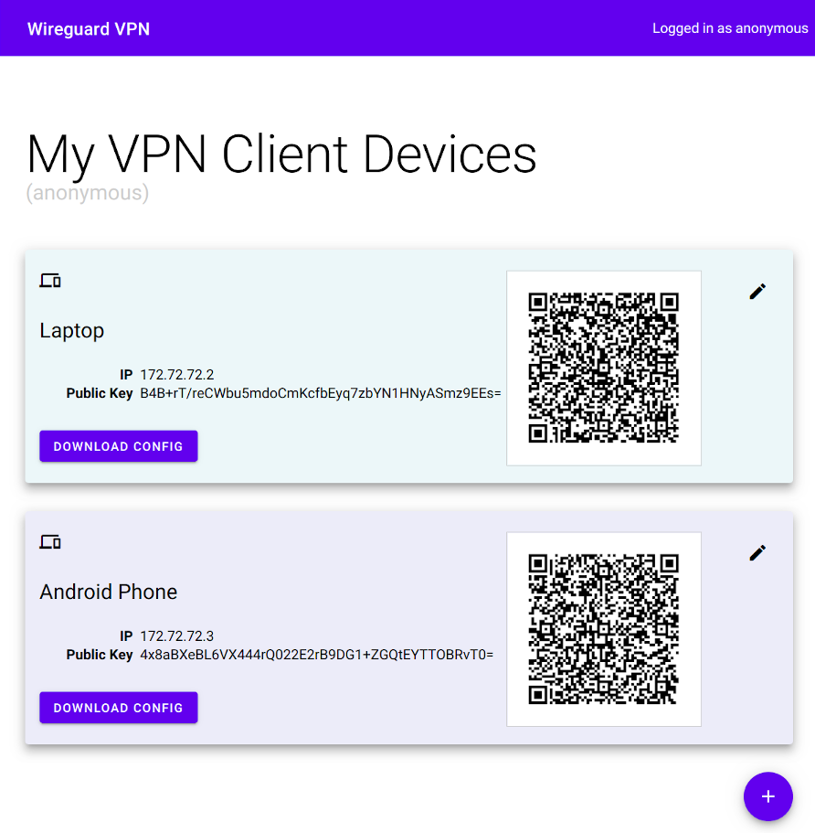

# WireGuard UI

[](https://github.com/EmbarkStudios/wireguard-ui/actions)
[](https://github.com/EmbarkStudios)
[](CODE_OF_CONDUCT.md)

A basic, self-contained management service for [WireGuard](https://wireguard.com) with a self-serve web UI.

## Features

 * Self-serve and web based
 * QR-Code for convenient mobile client configuration
 * Optional multi-user support behind an authenticating proxy
 * Zero external dependencies - just a single binary using the wireguard kernel module
 * Container-first deployment



## Running

The easiest way to run wireguard-ui is using the container image. To test it, run:

```docker run --rm -it --privileged --entrypoint "/wireguard-ui" -v /tmp/wireguard-ui:/data -p 8080:8080 -p 5555:5555 embarkstudios/wireguard-ui:latest --data-dir=/data --log-level=debug```

When running in production, we recommend using the latest release as opposed to `latest`.

## Developing

### Start frontend server
```
npm install --prefix=ui
npm run --prefix=ui dev
```

### Use frontend server when running the server

```
go get -u github.com/go-bindata/go-bindata/...
go get github.com/elazarl/go-bindata-assetfs/...
go-bindata-assetfs -prefix ui/dist ui/dist
go build .
sudo ./wireguard-ui --log-level=debug --dev-ui-server http://localhost:5000
```

## Contributing

We welcome community contributions to this project.

Please read our [Contributor Guide](CONTRIBUTING.md) for more information on how to get started.

## License
Licensed under either of

* Apache License, Version 2.0, ([LICENSE-APACHE](LICENSE-APACHE) or http://www.apache.org/licenses/LICENSE-2.0)
* MIT license ([LICENSE-MIT](LICENSE-MIT) or http://opensource.org/licenses/MIT)

at your option.

[](https://app.fossa.io/projects/git%2Bgithub.com%2FEmbarkStudios%2Fwireguard-ui?ref=badge_large)
